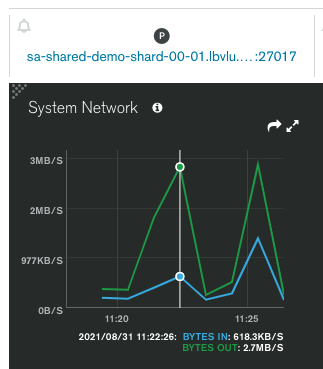
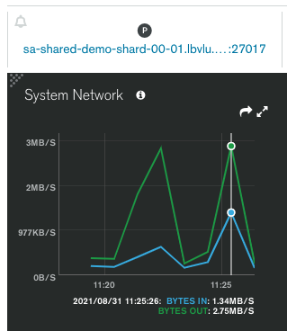

# MongoDB Network Compression

An under advertised feature of MongoDB is its ability to compress data between the client and the server. The CRM company Close has a really [nice article](https://making.close.com/posts/mongodb-network-compression) on how compression reduced their network traffic from about 140 Mbps to 65 Mpbs. As Close notes, with cloud data transfer costs ranging from $0.01 per GB and up, you can get a nice little savings with a simple configuration change. 

MongoDB supports the following compressors:

* [snappy](https://docs.mongodb.com/manual/reference/glossary/#std-term-snappy)
* [zlib](https://docs.mongodb.com/manual/reference/glossary/#std-term-zlib) (Available starting in MongoDB 3.6)
* [zstd](https://docs.mongodb.com/manual/reference/glossary/#std-term-zlib) (Available starting in MongoDB 4.2)

Enabling compression from the client simply involves installing the desired compression library and then passing the desired compressor as an argument when you connect to MongoDB. For example:

```PYTHON
client = MongoClient('mongodb://localhost', compressors='snappy')
```


This repository contains a tuneable Python script, [write-to-mongo.py](write-to-mongo.py), that you can use to see the impact of network compression yourself. The initial iteration uses [snappy](https://docs.mongodb.com/manual/reference/glossary/#std-term-snappy).


## Setup

### Compression Library
Snappy compression in Python requires the python-snappy package.

```ZSH
pip3 install python-snappy
pip3 install faker          # Used for data generation
```

### Client Configuration

Edit [params.py](params.py) and at a minimum, set your connection string. The other setting of interest is the compressors:

``` PYTHON
# Set to an empty string to turn off compression
compressor = 'snappy'
```

## Execution

Using the default settings, the script will insert records in batches of 10,000 for 60 seconds.

```ZSH
✗ python3 write-to-mongo.py

MongoDB Network Compression Test
Network Compression: Snappy
Now: 2021-08-31 12:25:33.090209

10000 records inserted in 5.25 seconds =  1907 records/second
20000 records inserted in 11.69 seconds =  1711 records/second
30000 records inserted in 18.29 seconds =  1640 records/second
40000 records inserted in 23.37 seconds =  1712 records/second
50000 records inserted in 28.41 seconds =  1760 records/second
60000 records inserted in 34.17 seconds =  1756 records/second
70000 records inserted in 39.34 seconds =  1779 records/second
80000 records inserted in 44.46 seconds =  1800 records/second
90000 records inserted in 49.53 seconds =  1817 records/second
100000 records inserted in 55.04 seconds =  1817 records/second
110000 records inserted in 60.57 seconds =  1816 records/second

110000 records inserted in 61.0 seconds
```

## Measurement

The are a couple of options for measuring network traffic. If you're using Atlas, it has a System Network metric that will demonstrate the differences between the 2 runs nicely.

The two screen captures below represent the same period of time. The two peaks represent the two executions of the script: first with compression on, then off.

You can see with compression on, `BYTES IN` peaked at `618.3KB/S`:



With compression off, `BYTES IN` peaked at `1.34MB/S`. 



Bottom line, compression reduced Network traffic by over 50%, which is in line with the improvement seen by Close. 


