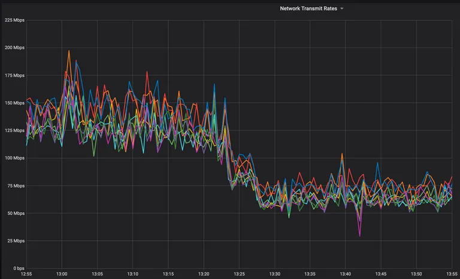

# MongoDB Network Compression

An under advertised feature of MongoDB is its ability to compress data between the client and the server. The CRM company Close has a really [nice article](https://making.close.com/posts/mongodb-network-compression) on how compression reduced their network traffic from about 140 Mbps to 65 Mpbs. As Close notes, with cloud data transfer costs ranging from $0.01 per GB and up, you can get a nice little savings with a simple configuration change. 



MongoDB supports the following compressors:

* [snappy](https://docs.mongodb.com/manual/reference/glossary/#std-term-snappy)
* [zlib](https://docs.mongodb.com/manual/reference/glossary/#std-term-zlib) (Available starting in MongoDB 3.6)
* [zstd](https://docs.mongodb.com/manual/reference/glossary/#std-term-zlib) (Available starting in MongoDB 4.2)

Enabling compression from the client simply involves installing the desired compression library and then passing the desired compressor as an argument when you connect to MongoDB. For example:

```PYTHON
client = MongoClient('mongodb://localhost', compressors='snappy')
```


This repository contains a tuneable Python script, [write-to-mongo.py](write-to-mongo.py), that you can use to see the impact of network compression yourself. The initial iteration uses [snappy](https://docs.mongodb.com/manual/reference/glossary/#std-term-snappy).


## Setup

### Compression Library
Snappy compression in Python requires the python-snappy package.

```pip3 install python-snappy```

### Data Generator
[Faker](https://faker.readthedocs.io/en/master/) is a Python package that is used to generate fake data for this test.

```pip3 install faker ```


### Client Configuration

Edit [params.py](params.py) and at a minimum, set your connection string. The other setting of interest is the compressors:

``` PYTHON
# Set to an empty string to turn off compression
compressor = 'snappy'
```

## Execution

Using the default settings, the script will insert 10 MB of data in batches of 1 MB.

```ZSH
✗ python3 write-to-mongo.py

MongoDB Network Compression Test
Network Compression: Snappy
Now: 2021-09-01 11:32:34.939621

Bytes to insert: 10 MB
Insert batch size 1 MB

1 megabytes inserted at 510.7 kilobytes/second
2 megabytes inserted at 527.8 kilobytes/second
3 megabytes inserted at 564.9 kilobytes/second
4 megabytes inserted at 572.4 kilobytes/second
5 megabytes inserted at 577.6 kilobytes/second
6 megabytes inserted at 593.1 kilobytes/second
7 megabytes inserted at 585.5 kilobytes/second
8 megabytes inserted at 594.7 kilobytes/second
9 megabytes inserted at 600.4 kilobytes/second
10 megabytes inserted at 607.4 kilobytes/second

 27778 records inserted in 16.0 seconds

 MongoDB Server Reported Megabytes In: 11.323 MB
```

Here's the same run without compression:

```zsh
✗ python3 write-to-mongo.py

MongoDB Network Compression Test
Network Compression: Off
Now: 2021-09-01 11:31:43.489983

Bytes to insert: 10 MB
Insert batch size 1 MB
1 megabytes inserted at 453.2 kilobytes/second
2 megabytes inserted at 473.1 kilobytes/second
3 megabytes inserted at 482.3 kilobytes/second
4 megabytes inserted at 453.4 kilobytes/second
5 megabytes inserted at 444.7 kilobytes/second
6 megabytes inserted at 464.9 kilobytes/second
7 megabytes inserted at 482.5 kilobytes/second
8 megabytes inserted at 497.4 kilobytes/second
9 megabytes inserted at 510.9 kilobytes/second
10 megabytes inserted at 523.8 kilobytes/second

 27778 records inserted in 19.0 seconds

 MongoDB Server Reported Megabytes In: 19.963 MB
 ```

## Measurement

There are a couple of options for measuring network traffic. 

The MongoDB serverStatus [network](https://docs.mongodb.com/manual/reference/command/serverStatus/#network) document reports on network use.

You can see from the tests above, inserting 10 MBs of data using the `snappy` compressor reported `11.323 MB In`. With no compression, the same 10 MBs of data consumed `19.963 MB`.

_If you're wondering why the reported numbers are double the data inserted, that's due to other workloads running on the server, and the TCP packet being larger than just the data. Focus on the delta between the 2 tests runs._

Another option would be using a network analysis tool like [Wireshark](https://www.wireshark.org/). But that's beyond the scope of this article for now.

Bottom line, compression reduced Network traffic by about 50%, which is in line with the improvement seen by Close. 


