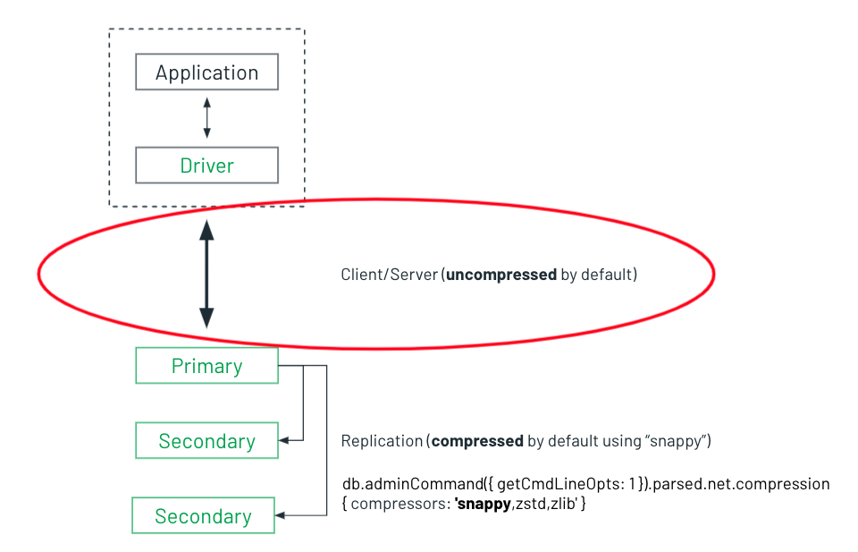

# MongoDB Network Compression: A Win-Win

An under-advertised feature of MongoDB is its ability to compress data between the client and the server. By default, data over the wire is compressed between replicaset nodes, but not between your client and the replicaset:



The CRM company Close has a really [nice article](https://making.close.com/posts/mongodb-network-compression) on how compression reduced their network traffic from about 140 Mbps to 65 Mpbs. As Close notes, with cloud data transfer costs ranging from $0.01 per GB and up, you can get a nice little savings with a simple configuration change. 


MongoDB supports the following compressors:

* [snappy](https://docs.mongodb.com/manual/reference/glossary/#std-term-snappy)
* [zlib](https://docs.mongodb.com/manual/reference/glossary/#std-term-zlib) (Available starting in MongoDB 3.6)
* [zstd](https://docs.mongodb.com/manual/reference/glossary/#std-term-zlib) (Available starting in MongoDB 4.2)

Enabling compression from the [client](https://pymongo.readthedocs.io/en/stable/api/pymongo/mongo_client.html) simply involves installing the desired compression library and then passing the compressor as an argument when you connect to MongoDB. For example:

```PYTHON
client = MongoClient('mongodb://localhost', compressors='zstd')
```


This repository contains two tuneable Python scripts, [read-from-mongo.py](read-from-mongo.py) and [write-to-mongo.py](write-to-mongo.py), that you can use to see the impact of network compression yourself. The scripts pull their data from the `network` propert of the [db.serverStatus()](https://www.mongodb.com/docs/manual/reference/method/db.serverStatus/) command:

```JavaScript
db.serverStatus().network
{
  bytesIn: Long("276555533"),
  bytesOut: Long("2172551909"),
  physicalBytesIn: Long("158645659"),
  physicalBytesOut: Long("1451458669"),
  numSlowDNSOperations: Long("0"),
  numSlowSSLOperations: Long("0"),
  numRequests: Long("611797"),
  tcpFastOpen: {
    kernelSetting: Long("0"),
    serverSupported: true,
    clientSupported: false,
    accepted: Long("0")
  },
  compression: {
    snappy: {
      compressor: { bytesIn: Long("351786031"), bytesOut: Long("217301191") },
      decompressor: { bytesIn: Long("73430495"), bytesOut: Long("149034178") }
    },
    zstd: {
      compressor: { bytesIn: Long("0"), bytesOut: Long("0") },
      decompressor: { bytesIn: Long("0"), bytesOut: Long("0") }
    },
    zlib: {
      compressor: { bytesIn: Long("909718996"), bytesOut: Long("319762999") },
      decompressor: { bytesIn: Long("109890"), bytesOut: Long("123176") }
    }
  },
  ```

## Setup

### Client Configuration

Edit [params.py](params.py) and at a minimum, set your connection string. Other tunables include the amount of bytes to read and insert (default 10 MB) and the batch size to read (100 records) and insert (1 MB):

``` PYTHON
# Read to Mongo
target_read_database        = 'sample_airbnb'
target_read_collection      = 'listingsAndReviews'
megabytes_to_read           = 10
batch_size                  = 100   # Batch size in records (for reads)

# Write to Mongo
drop_collection             = True  # Drop collection on run
target_write_database       = 'test'
target_write_collection     = 'network-compression-test'
megabytes_to_insert         = 10
batch_size_mb               = 1     # Batch size of bulk insert in megabytes
```
### Compression Library
The [snappy](https://docs.mongodb.com/manual/reference/glossary/#std-term-snappy) compression in Python requires the `python-snappy` package.

```pip3 install python-snappy```

The [zstd](https://docs.mongodb.com/manual/reference/glossary/#std-term-zlib) compression requires the zstandard package

```pip3 install zstandard```

The [zlib](https://docs.mongodb.com/manual/reference/glossary/#std-term-zlib) compression is native to Python.

### Sample Data
My [read-from-mongo.py](read-from-mongo.py) script uses the [Sample AirBnB Listings Dataset](https://docs.atlas.mongodb.com/sample-data/sample-airbnb/#std-label-sample-airbnb) but ANY dataset will suffice for this test. 

The [write-to-mongo.py](write-to-mongo.py) script generates sample data using the Python package 
[Faker](https://faker.readthedocs.io/en/master/).

```pip3 install faker ```

## Execution
### Read from Mongo
The cloud providers notably charge for data egress, so anything that reduces network traffic out is a win. 

Let's first run the script without network compression (the default):

```ZSH
✗ python3 read-from-mongo.py

MongoDB Network Compression Test
Network Compression: Off
Now: 2021-11-03 12:24:00.904843

Collection to read from: sample_airbnb.listingsAndReviews
Bytes to read: 10 MB
Bulk read size: 100 records

1 megabytes read at 307.7 kilobytes/second
2 megabytes read at 317.6 kilobytes/second
3 megabytes read at 323.5 kilobytes/second
4 megabytes read at 318.0 kilobytes/second
5 megabytes read at 327.1 kilobytes/second
6 megabytes read at 325.3 kilobytes/second
7 megabytes read at 326.0 kilobytes/second
8 megabytes read at 324.0 kilobytes/second
9 megabytes read at 322.7 kilobytes/second
10 megabytes read at 321.0 kilobytes/second

 8600 records read in 31 seconds (276.0 records/second)

 MongoDB Server Reported Megabytes Out: 188.278 MB
 ```

_You've obviously noticed the report Megabytes out (188 MB) are more than 18 times our test size of 10 MBs. There are several reasons for this, including other workloads running on the server, data replication to secondary nodes, and the TCP packet being larger than just the data. Focus on the delta between the other tests runs._

The script accepts an optional compression argument, that must be either `snappy`, `zlib` or `zstd`. Let's run the test again using `snappy`, which is known to be fast, while sacrificing some compression:

```ZSH
✗ python3 read-from-mongo.py -c "snappy"

MongoDB Network Compression Test
Network Compression: snappy
Now: 2021-11-03 12:24:41.602969

Collection to read from: sample_airbnb.listingsAndReviews
Bytes to read: 10 MB
Bulk read size: 100 records

1 megabytes read at 500.8 kilobytes/second
2 megabytes read at 493.8 kilobytes/second
3 megabytes read at 486.7 kilobytes/second
4 megabytes read at 480.7 kilobytes/second
5 megabytes read at 480.1 kilobytes/second
6 megabytes read at 477.6 kilobytes/second
7 megabytes read at 488.4 kilobytes/second
8 megabytes read at 482.3 kilobytes/second
9 megabytes read at 482.4 kilobytes/second
10 megabytes read at 477.6 kilobytes/second

 8600 records read in 21 seconds (410.7 records/second)

 MongoDB Server Reported Megabytes Out: 126.55 MB
```
With `snappy` compression, our reported bytes out were about `62 MBs` fewer. That's a `33%` savings. But wait, the `10 MBs` of data was read in `10` fewer seconds. That's also a `33%` performance boost!

Let's try this again using `zlib`, which can achieve better compression, but at the expense of performance.  

_[zlib](https://docs.mongodb.com/manual/reference/glossary/#std-term-zlib) compression supports an optional compression level. For this test I've set it to `9` (max compression)._

```ZSH
✗ python3 read-from-mongo.py -c "zlib"

MongoDB Network Compression Test
Network Compression: zlib
Now: 2021-11-03 12:25:07.493369

Collection to read from: sample_airbnb.listingsAndReviews
Bytes to read: 10 MB
Bulk read size: 100 records

1 megabytes read at 362.0 kilobytes/second
2 megabytes read at 373.4 kilobytes/second
3 megabytes read at 394.8 kilobytes/second
4 megabytes read at 393.3 kilobytes/second
5 megabytes read at 398.1 kilobytes/second
6 megabytes read at 397.4 kilobytes/second
7 megabytes read at 402.9 kilobytes/second
8 megabytes read at 397.7 kilobytes/second
9 megabytes read at 402.7 kilobytes/second
10 megabytes read at 401.6 kilobytes/second

 8600 records read in 25 seconds (345.4 records/second)

 MongoDB Server Reported Megabytes Out: 67.705 MB
 ```
 With `zlib` compression configured at its maximum compression level, we were able to achieve a `64%` reduction in network egress, although it took 4 seconds longer. However, that's still a `19%` performance improvement over using no compression at all.

 Let's run a final test using `zstd`, which is advertised to bring together speed of `snappy` with the compression efficiency of `zlib`:

 ```ZSH
 ✗ python3 read-from-mongo.py -c "zstd"

MongoDB Network Compression Test
Network Compression: zstd
Now: 2021-11-03 12:25:40.075553

Collection to read from: sample_airbnb.listingsAndReviews
Bytes to read: 10 MB
Bulk read size: 100 records

1 megabytes read at 886.1 kilobytes/second
2 megabytes read at 798.1 kilobytes/second
3 megabytes read at 772.2 kilobytes/second
4 megabytes read at 735.7 kilobytes/second
5 megabytes read at 734.4 kilobytes/second
6 megabytes read at 714.8 kilobytes/second
7 megabytes read at 709.4 kilobytes/second
8 megabytes read at 698.5 kilobytes/second
9 megabytes read at 701.9 kilobytes/second
10 megabytes read at 693.9 kilobytes/second

 8600 records read in 14 seconds (596.6 records/second)

 MongoDB Server Reported Megabytes Out: 61.254 MB
 ```
And sure enough, `zstd` lives up to its reputation, achieving `68%` percent improvement in compression along with a `55%` improvement in performance!

### Write to Mongo

The cloud providers often don't charge us for data ingress. However, given the substantial performance improvements with read workloads, what can be expected from write workloads?

The [write-to-mongo.py](write-to-mongo.py) script writes a randomly generated document to the database and collection configured in [params.py](params.py), the default being `test.network_compression_test`.

As before let's run the test without compression:

```ZSH
python3 write-to-mongo.py

MongoDB Network Compression Test
Network Compression: Off
Now: 2021-11-03 12:47:03.658036

Bytes to insert: 10 MB
Bulk insert batch size: 1 MB

1 megabytes inserted at 614.3 kilobytes/second
2 megabytes inserted at 639.3 kilobytes/second
3 megabytes inserted at 652.0 kilobytes/second
4 megabytes inserted at 631.0 kilobytes/second
5 megabytes inserted at 640.4 kilobytes/second
6 megabytes inserted at 645.3 kilobytes/second
7 megabytes inserted at 649.9 kilobytes/second
8 megabytes inserted at 652.7 kilobytes/second
9 megabytes inserted at 654.9 kilobytes/second
10 megabytes inserted at 657.2 kilobytes/second

 27778 records inserted in 15.0 seconds

 MongoDB Server Reported Megabytes In: 21.647 MB
```

So it took `15` seconds to write `27,778` records. Let's run the same test with `zstd` compression:

```ZSH
✗ python3 write-to-mongo.py -c 'zstd'

MongoDB Network Compression Test
Network Compression: zstd
Now: 2021-11-03 12:48:16.485174

Bytes to insert: 10 MB
Bulk insert batch size: 1 MB

1 megabytes inserted at 599.4 kilobytes/second
2 megabytes inserted at 645.4 kilobytes/second
3 megabytes inserted at 645.8 kilobytes/second
4 megabytes inserted at 660.1 kilobytes/second
5 megabytes inserted at 669.5 kilobytes/second
6 megabytes inserted at 665.3 kilobytes/second
7 megabytes inserted at 671.0 kilobytes/second
8 megabytes inserted at 675.2 kilobytes/second
9 megabytes inserted at 675.8 kilobytes/second
10 megabytes inserted at 676.7 kilobytes/second

 27778 records inserted in 15.0 seconds

 MongoDB Server Reported Megabytes In: 8.179 MB
 ```
Our reported megabytes in are reduced by `62%`. However, our write performance remained identical. Personally, I think most of this is due to the time it takes the [Faker](https://faker.readthedocs.io/en/master/) library to generate the sample data. But having gained compression without a performance impact it is still a win.
## Measurement

There are a couple of options for measuring network traffic. This script is using the [db.serverStatus()](https://docs.mongodb.com/manual/reference/method/db.serverStatus/) `physicalBytesOut` and `physicalBytesIn`, reporting on the delta between the reading at the start and end of the test run. As mentioned previously, our measurements are corrupted by other network traffic occuring on the server, but my tests have shown a consistent improvement when run. Visually, my results achieved appear as follows:


Another option would be using a network analysis tool like [Wireshark](https://www.wireshark.org/). But that's beyond the scope of this article for now.

Bottom line, compression reduces network traffic by more than 60%, which is in line with the improvement seen by Close. More importantly, compression also had a dramatic improvement on read performance. That's a Win-Win.


