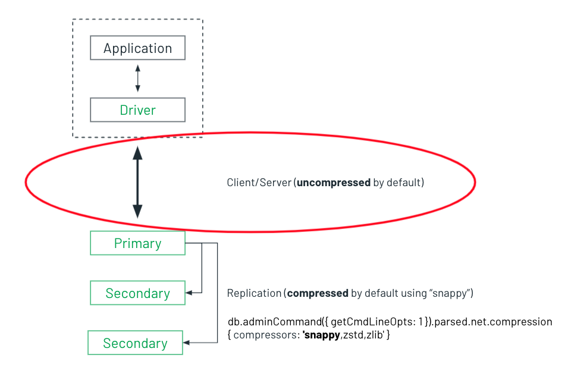

# MongoDB Network Compression - Java Example

A Java Example of [MongoDB Network Compression](../READ.md).

An under-advertised feature of MongoDB is its ability to compress data between the client and the server. By default, data over the wire is compressed between replicaset nodes, but not between your client and the replicaset:



MongoDB supports the following compressors:

* [snappy](https://docs.mongodb.com/manual/reference/glossary/#std-term-snappy)
* [zlib](https://docs.mongodb.com/manual/reference/glossary/#std-term-zlib) (Available starting in MongoDB 3.6)
* [zstd](https://docs.mongodb.com/manual/reference/glossary/#std-term-zlib) (Available starting in MongoDB 4.2)

Enabling compression from the [client](https://docs.mongodb.com/drivers/java/sync/current/fundamentals/connection/#compression) simply involves installing the desired compression library and then passing the compressor as an argument when you connect to MongoDB. For example:

```Java
ConnectionString connectionString = new ConnectionString("mongodb://localhost/?compressors=zstd");
MongoClient mongoClient = MongoClients.create(connectionString);
```

This repository contains a tuneable Java program, [App.java](rsrc/main/java/com/mongodb/java/bootstrap/App.java), that you can use to see the impact of network compression yourself. 

## Setup
### Client Configuration

Edit [run.sh](run.sh) and at a minimum, set your connection string. Other tunables include the namespace to read from and the amount of bytes to read (default 10 MB).

You pass the compressor to use as the first argument.

```zsh
export mongodbURI="mongodb://localhost:27017/test?"
export targetReadDatabase="sample_airbnb"
export targetReadCollection="listingsAndReviews"
export compressor=$1   # Compressor - One of unset, "zstd", "snappy" or "zlib"

export megabytesToRead=10
```
### Dependency Management
This example uses Maven. 

`zlib` is included with in the Java library. 

[Snappy-java](https://github.com/xerial/snappy-java}) is available from Maven's central repository. Add the following dependency to your pom.xml:

```xml
    <dependency>
      <groupId>org.xerial.snappy</groupId>
      <artifactId>snappy-java</artifactId>
      <version>1.1.8.4</version>
      <type>jar</type>
      <scope>compile</scope>
    </dependency>
  ```
[zstd](https://github.com/luben/zstd-jni) available from Maven's central repository. Add the following dependency to your pom.xml:

```xml
    <dependency>
      <groupId>com.github.luben</groupId>
      <artifactId>zstd-jni</artifactId>
      <version>1.5.0-4</version>
    </dependency>
  ```

```Shell
% mvn clean install
```
## Execution

Let's first run the script without network compression (the default):

```zsh
✗ ./run.sh 

MongoDB Network Compression Test
MongoDB Driver Version: 4.3.3
Network Compression: Off
Now: 2021-11-17 12:22:48

Collection to read from: sample_airbnb.listingsAndReviews
Bytes to read: 10 MB
Batch read size: 100 records

1 megabytes read at 371.507 kilobytes/second
2 megabytes read at 673.729 kilobytes/second
3 megabytes read at 509.803 kilobytes/second
4 megabytes read at 680.191 kilobytes/second
5 megabytes read at 843.652 kilobytes/second
6 megabytes read at 1023.571 kilobytes/second
7 megabytes read at 1182.174 kilobytes/second
8 megabytes read at 1327.573 kilobytes/second
9 megabytes read at 1487.714 kilobytes/second
10 megabytes read at 1642.729 kilobytes/second

393 records read in 6 seconds (65 records/second)
MongoDB ServerReported Megabytes Out: 19.244 MB
```
_You've obviously noticed the report Megabytes out (19.244 MB) are almost double our test size of 10 MBs. There are several reasons for this, including other workloads running on the server, data replication to secondary nodes, and the TCP packet being larger than just the data. Focus on the delta between the other tests runs._

The run script accepts an optional compression argument, that must be either `snappy`, `zlib` or `zstd`. Let's run the test again using `snappy`, which is known to be fast, while sacrificing some compression:

```zsh
✗ ./run.sh snappy

MongoDB Network Compression Test
MongoDB Driver Version: 4.3.3
Network Compression: snappy
Now: 2021-11-17 12:28:50

Collection to read from: sample_airbnb.listingsAndReviews
Bytes to read: 10 MB
Batch read size: 100 records

1 megabytes read at 347.715 kilobytes/second
2 megabytes read at 631.091 kilobytes/second
3 megabytes read at 593.493 kilobytes/second
4 megabytes read at 792.440 kilobytes/second
5 megabytes read at 979.368 kilobytes/second
6 megabytes read at 1186.570 kilobytes/second
7 megabytes read at 1371.486 kilobytes/second
8 megabytes read at 1535.515 kilobytes/second
9 megabytes read at 1717.051 kilobytes/second
10 megabytes read at 1898.928 kilobytes/second

393 records read in 5 seconds (78 records/second)
MongoDB ServerReported Megabytes Out: 11.745 MB
```

With snappy compression, our reported bytes out were about `7.5 MBs` fewer. That's a `39%` savings. But wait, we were also able to read an additional `13` records per second, an almost `17%` read performance improvement!

Let's try this again using `zlib`, which can achieve better compression, but at the expense of performance.

_zlib compression supports an optional compression level, but for this test I'm just using the default, which is 6._

```zsh
✗ ./run.sh zlib  

MongoDB Network Compression Test
MongoDB Driver Version: 4.3.3
Network Compression: zlib
Now: 2021-11-17 12:30:02

Collection to read from: sample_airbnb.listingsAndReviews
Bytes to read: 10 MB
Batch read size: 100 records

1 megabytes read at 343.861 kilobytes/second
2 megabytes read at 622.854 kilobytes/second
3 megabytes read at 570.692 kilobytes/second
4 megabytes read at 761.546 kilobytes/second
5 megabytes read at 944.833 kilobytes/second
6 megabytes read at 1145.369 kilobytes/second
7 megabytes read at 1322.988 kilobytes/second
8 megabytes read at 1485.119 kilobytes/second
9 megabytes read at 1663.175 kilobytes/second
10 megabytes read at 1838.988 kilobytes/second

393 records read in 5 seconds (78 records/second)
MongoDB ServerReported Megabytes Out: 6.811 MB
```

With `zlib` compression configured at its default compression level, we were able to achieve a 65% reduction in network egress, while achieving the same read throughput as `snappy`.

Let's run a final test using `zstd`, which is advertised to bring together speed of `snappy` with the compression efficiency of `zlib`:

```zsh
✗ ./run.sh zstd

MongoDB Network Compression Test
MongoDB Driver Version: 4.3.3
Network Compression: zstd
Now: 2021-11-17 12:30:28

Collection to read from: sample_airbnb.listingsAndReviews
Bytes to read: 10 MB
Batch read size: 100 records

1 megabytes read at 378.235 kilobytes/second
2 megabytes read at 685.715 kilobytes/second
3 megabytes read at 759.864 kilobytes/second
4 megabytes read at 1013.604 kilobytes/second
5 megabytes read at 1256.381 kilobytes/second
6 megabytes read at 1522.207 kilobytes/second
7 megabytes read at 1752.135 kilobytes/second
8 megabytes read at 1958.730 kilobytes/second
9 megabytes read at 2189.282 kilobytes/second
10 megabytes read at 2420.445 kilobytes/second

393 records read in 4 seconds (98 records/second)
MongoDB ServerReported Megabytes Out: 6.155 MB
```

And sure enough, `zstd` lives up to its reputation, achieving 68% percent improvement in compression along with a `51%` improvement in read throughput!

# Measurement

There are a couple of options for measuring network traffic. This script is using the [db.serverStatus()](https://docs.mongodb.com/manual/reference/method/db.serverStatus/) `physicalBytesOut` and `physicalBytesIn`, reporting on the delta between the reading at the start and end of the test run. As mentioned previously, our measurements are corrupted by other network traffic occuring on the server, but my tests have shown a consistent improvement when run. 

Another option would be using a network analysis tool like [Wireshark](https://www.wireshark.org/). But that's beyond the scope of this article for now.

Bottom line, compression reduces network traffic by more than `60%`. More importantly, compression also had a dramatic improvement on read performance. That's a Win-Win.

# Verification
If the verbosity level of the mongod log file is increased to include debug messages, you'll find messages in the log such as:

```zsh
{"t":{"$date":"2021-11-17T11:04:42.804-05:00"},"s":"D3", "c":"NETWORK",  "id":22927,   "ctx":"conn141","msg":"Decompressing message","attr":{"compressor":"zstd"}}
```
For a full summary of the message types, see the [Wire Compression in Drivers speficication](https://github.com/mongodb/specifications/blob/master/source/compression/OP_COMPRESSED.rst).

See [db.setLogLevel()](https://docs.mongodb.com/manual/reference/method/db.setLogLevel/) for how to increase your log level. Use leve `3` to see the compression messages.


_Note, it's currently not possible to set the log level in Atlas: [Unsupported Commands in M10+ Clusters](https://docs.atlas.mongodb.com/reference/unsupported-commands-paid-tier-clusters/). See [Support db.setLogLevel() in Atlas](https://feedback.mongodb.com/forums/924145-atlas/suggestions/44452887-support-db-setloglevel-in-atlas) for the feature request._


